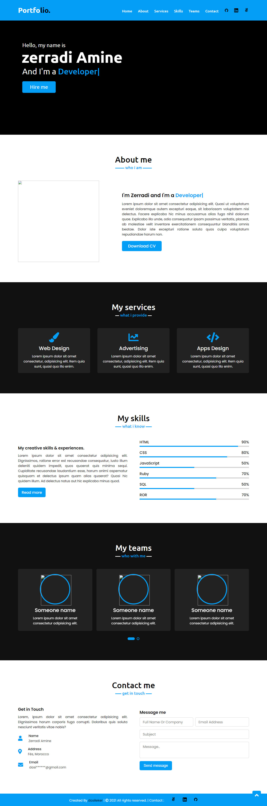

## Portfiolio 

- in this Project for the Portfolio assesement

## built with

- HTML && CSS && BOOTSRTAP
- LINTERS &  HINTRC

# Screenshot of the page

## Live demo link 

- <a href="https://zerradi.web.app/">Live Demo Link</a>

## Author 

- @Zerradi Amine (github) : (www.github.com/dasileker)

## License

- this Project is MIT license

## Feedback

- if you have any question please open an issue

## support 
 
 -  give a star ⭐ if you like it

 ## License

 - MIT 1.0.2 

